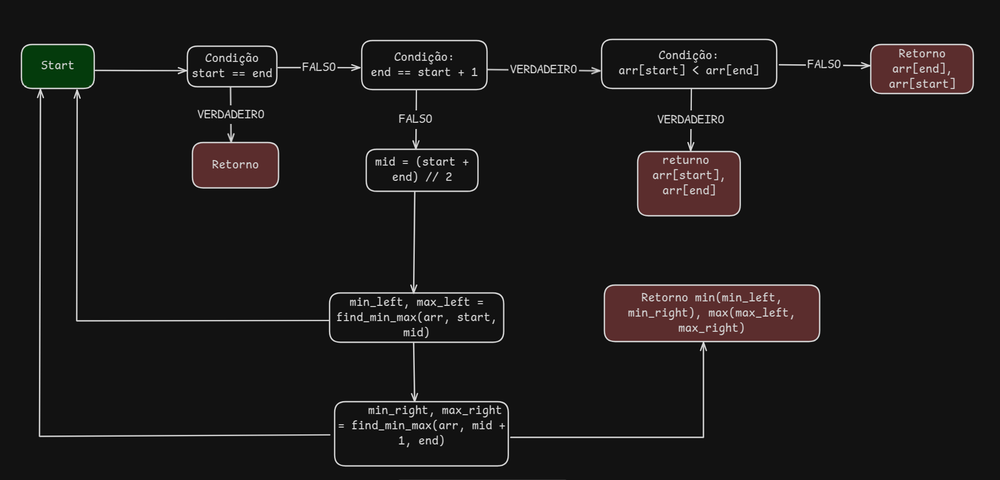

# MaxMin-Select-Algorithm

## Descrição do Projeto

Este projeto tem como objetivo implementar o algoritmo **MaxMin Select**, que realiza a seleção simultânea do maior e do menor elemento em uma sequência de números. A implementação utiliza a técnica de **divisão e conquista**, garantindo uma busca eficiente e reduzindo o número de comparações em relação a abordagens ingênuas.

O algoritmo funciona da seguinte maneira:
1. **Divisão**: O array é dividido recursivamente em partes menores até que cada subproblema contenha um ou dois elementos.
2. **Conquista**: O menor e o maior elemento de cada subproblema são identificados.
3. **Combinação**: Os resultados dos subproblemas são combinados para determinar o mínimo e o máximo globais.

A abordagem utilizada reduz o número de comparações em relação ao método tradicional de percorrer o array inteiro duas vezes, tornando-o mais eficiente. Esse método é particularmente útil para grandes conjuntos de dados, onde otimizar comparações pode gerar um ganho significativo de desempenho.

A implementação foi feita em **Python**, e foi implementado testes unitários para validar o funcionamento


## Como Executar o Projeto

Antes de rodar o projeto, certifique-se de ter o **Python 3.x** instalado em sua máquina.

### Passos para execução

1. **Clone o repositório** para sua máquina local:
   ```bash
   git clone https://github.com/seuusuario/MaxMinSelect.git
   ```
2. **Acesse a pasta do projeto**:
   ```bash
   cd MaxMinSelect
   ```
3. **Execute o script principal** para processar os números e exibir o maior e o menor valor encontrados:
   ```bash
   python main.py
   ```
   
Se preferir, você pode modificar a entrada diretamente no código ou adaptá-lo para receber valores do usuário em tempo de execução.

## Grafo do Algoritmo
Representa a ilustração do fluxo do problema.




## Complexidade Assintótica

A complexidade assintótica é uma forma de descrever o comportamento de um algoritmo conforme o tamanho da entrada aumenta. Esse conceito permite avaliar a eficiência e comparar diferentes algoritmos para um mesmo problema.

A abordagem tradicional para encontrar o maior e o menor elemento de um conjunto de dados exige percorrer a lista duas vezes: uma para encontrar o menor valor e outra para encontrar o maior. Isso resulta em **2(n-1)** comparações.

Já o algoritmo **MaxMin Select** reduz esse número significativamente ao processar os elementos em pares, realizando **aproximadamente 3n/2 comparações**. Essa otimização ocorre porque, em vez de percorrer o array separadamente para cada valor, os pares de elementos são comparados entre si, reduzindo o número total de verificações necessárias.

A estrutura do algoritmo baseada em **divisão e conquista** resulta em uma complexidade **O(n)**, pois as comparações são reduzidas à medida que os subproblemas são resolvidos e combinados.

A relação de recorrência para o número de operações pode ser descrita como:

```math
T(n) = 2T(n/2) + O(1)
```

Onde o método de árvore de recorrência ficaria assim:
1. **(T(n))**
2. **(2T(n/2) + 2)**
3. **(4T(n/4) + 4)**
4. **(2^k T(n/2^k) + 2^k)**
- **T(n) = O(n)**, pois o processo iria continuar até (n/2^k = 1), logo (k = \log_2 n).

### Teorema Mestre
A Relação de Recorrência é:

```math
T(n) = 2T(n/2) + O(1)
```

Podemos aplicar o **Teorema Mestre** para encontrar a complexidade. Formula do teorema:

```math
aT(n/b) + f(n)
```

onde 𝑎 é o número de subproblemas, 𝑏 é o fator de redução do tamanho do problema, e 𝑓(𝑛) é o custo externo relacionado à divisão e combinação dos subproblemas.

- Valor de **a**: 2
- Valor de **b**: 2
- Valor de **f(n)**: O(n)

Depois de identificar os valores, temos que calcular o valor de n^[\log_b a] 
- n^[\log_2 2]
- n¹
- n

Agora precisamos identificar a qual dos três casos do Teorema Mestre se enquadra aqui:
1. ( f(n) < n log_b a )
2. ( f(n) = n log_b a )
3. ( f(n) > n log_b a )

Podemos identificar que o algorírmo Max Min Select se enquadra no primeiro caso **( f(n) < n log_b a )**, logo a **Solução assintótica** será:

#### T(n) = O(n¹) = O(n)

A complexidade é O(n).

## Conclusão
O algoritmo **MaxMin Select** se destaca pela sua abordagem eficiente ao reduzir o número de comparações necessárias para encontrar os valores mínimo e máximo em uma sequência de números. Utilizando a estratégia de **divisão e conquista**, ele melhora o desempenho em relação ao método tradicional, que requer um maior número de operações. 

A análise da complexidade assintótica demonstrou que o algoritmo opera em **O(n)**, garantindo uma execução linear mesmo para grandes conjuntos de dados. Isso reforça sua aplicabilidade em cenários onde a eficiência é um fator crítico.

Além disso, a implementação em **Python** e os testes unitários desenvolvidos asseguram a confiabilidade da solução, permitindo que o código seja facilmente adaptado e expandido conforme necessário. Dessa forma, o **MaxMin Select** se apresenta como uma alternativa sólida para problemas que envolvem a busca simultânea dos extremos em uma coleção de dados.


